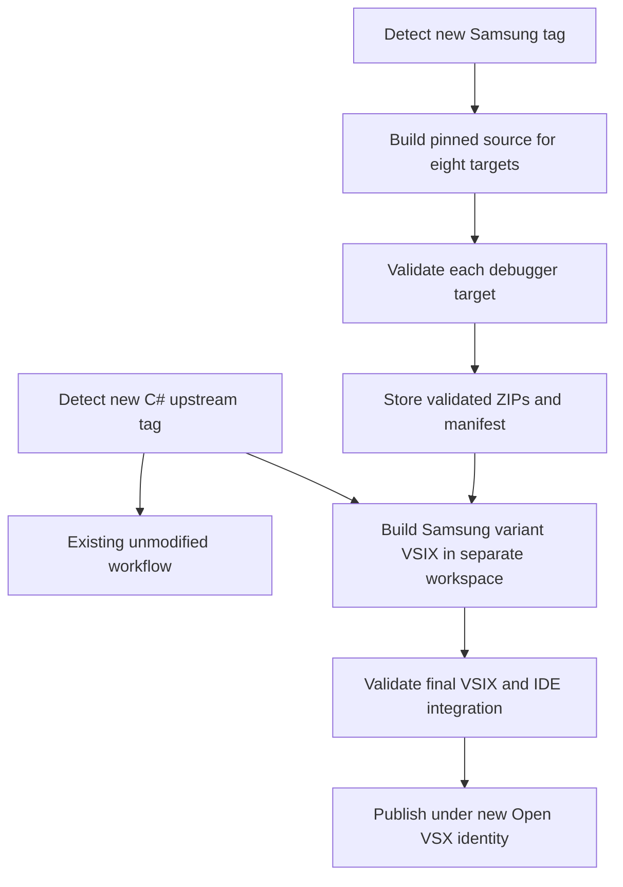

# Independent automated distribution of C# (with Samsung Debugger)

On September 6, 2026, this review examined the existing `vscode-csharp-autobuild` workflow, Samsung tags, Open VSX identities, and C# packaging code. This repository can preserve its unmodified distribution while producing a separate VSIX containing self-built Samsung netcoredbg and publishing it to Open VSX. Earlier experiments passed macOS ARM64 source builds and basic debugging; the remaining platform validation is distinguished below. [Review evidence](samsung-variant-2026-09-06/review-evidence.json)

The review covers distribution identities, detection of two upstreams, platform builds, VSIX integration, version and publication state, and differences from the community extension. The proposed display name is `C# (with Samsung Debugger)`. It describes the included debugger without claiming full replacement of Microsoft's debugger features or C# Dev Kit.

The report defines the boundary with the current distribution, then describes the tag-to-publication flow, integration points, operational conflicts, and comparison with muhammad-sammy. The identities and file layouts are proposals; no remote repository or publication was created during this review.

The review has the following scope:

> This is a design assessment as of September 6, 2026. No new GitHub Actions workflow, eight-platform build matrix, integrated VSIX, or Open VSX publication was executed in this review. An API lookup of the candidate ID does not reserve it or grant publication rights.

## 1. Separate extension identities and publication paths in one repository

Open VSX namespaces and the VS Code `${publisher}.${name}` identity allow two extensions under the same publisher. Changing only the display name does not create a distinct identity, so the proposed variant also changes `name`. [Open VSX publication](https://github.com/eclipse-openvsx/openvsx/wiki/Publishing-Extensions), [extension manifest](https://code.visualstudio.com/api/references/extension-manifest)

| Item | Existing distribution | Proposed Samsung variant |
| --- | --- | --- |
| `publisher` | `dotnetdev-kr-custom` | `dotnetdev-kr-custom` |
| `name` | `csharp` | `csharp-with-samsung-debugger` |
| Extension ID | `dotnetdev-kr-custom.csharp` | `dotnetdev-kr-custom.csharp-with-samsung-debugger` |
| Display name | Preserve existing configuration | `C# (with Samsung Debugger)` |
| Workflow | Preserve `build-and-release.yml` | Separate detection, debugger build, and VSIX integration workflows |
| Publication state | Preserve `.last_built_sha` | For example, `state/samsung-debugger.json` |
| GitHub tags | Preserve existing upstream-tag names | For example, `csharp-samsung-v0.1.0` |

The candidate ID's `latest` endpoint returned HTTP 404 during this lookup. No current publication was found through that endpoint, but no name was reserved and no namespace rights were changed. The description can identify this repository as the builder and credit Samsung netcoredbg. [Lookup evidence](samsung-variant-2026-09-06/review-evidence.json)

Separate IDs isolate distribution and updates, but do not guarantee simultaneous activation. Both extensions can contribute C# language features and `coreclr` registrations. The supported workspace configuration must account for selecting the active distribution. Automatic migration from the old ID is outside this proposal. [Factory registration constraint](https://code.visualstudio.com/api/references/vscode-api#debug.registerDebugAdapterDescriptorFactory)

## 2. Tag detection and builds for two independent upstreams

A local `push.tags` or `release` trigger does not directly subscribe to tag creation in Samsung's repository. A scheduled workflow can poll Samsung's tags. `repository_dispatch` is another option when an external sender exists; polling avoids requiring such a sender. [GitHub workflow events](https://docs.github.com/en/actions/reference/workflows-and-actions/events-that-trigger-workflows)

The first run can establish a selected baseline tag, then record each newly discovered tag for processing. Pin both the tag name and its resolved commit. Tag creation is separate from GitHub Release publication: reading only `releases/latest` can miss tags without releases. Per-tag processing state also handles multiple tags appearing between scans. [Samsung tags API](https://api.github.com/repos/Samsung/netcoredbg/tags)

The proposed flow connects builds and publication as follows:

A Samsung tag change rebuilds the debugger and tests it with the selected C# source. A C#-only change reuses the last validated debugger ZIPs and tests the new combination. This delivers language-service updates even when Samsung has no new release and avoids recompiling unchanged native inputs for every C# update.

Scheduled execution is not immediate event delivery. GitHub documents possible delays and automatic disabling after extended inactivity in public repositories. Per-tag state allows a later run to recover missed scans; monitoring the last successful scan exposes a stopped schedule. [Schedule behavior](https://docs.github.com/en/actions/reference/workflows-and-actions/events-that-trigger-workflows#schedule)

## 3. Eight debugger packages built from the selected tag

The target set matches the existing extension: `win32-x64`, `win32-arm64`, `linux-x64`, `linux-arm64`, `alpine-x64`, `alpine-arm64`, `darwin-x64`, and `darwin-arm64`. Map VSIX target names to .NET RIDs explicitly, including the target CPU, C runtime, executable, and dbgshim. [Existing targets](https://github.com/dotnet/vscode-csharp/blob/2f5806a9f39575bfaf4ca16445f420440a43e050/tasks/packaging/offlinePackagingTasks.ts#L45)

All builds use the same Samsung tag and source SHA, with checks that the original input files remain unchanged. Pin CoreCLR inputs, SDKs, CMake, compilers, and NuGet dependencies as well. Collect the executable, ManagedPart, Roslyn DLLs, matching dbgshim, notices, and provenance. A consistent ZIP layout allows reuse of the existing extension installer. [Source-build and dependency assessment](2026-09-06-netcoredbg-source-build.md)

Validation extracts each ZIP into a separate directory and checks binary architecture, dynamic dependencies, permissions, and DAP behavior. A new tag is not assumed to work on every target. If simultaneous eight-target support is the product criterion, any failed target can prevent promotion of the new combination.

The direct experiments verified unmodified macOS ARM64 and x64 builds and basic .NET 8 and .NET 10 DAP behavior on ARM64. macOS x64 execution and self-builds and execution on Windows and Linux remain outstanding, especially Windows ARM64 and both Alpine targets. Build automation alone cannot fix source incompatibilities with a platform or runtime. Under a strict source-preservation policy, the last validated combination can remain available while a new combination is held back. [Experimental evidence](netcoredbg-source-build-2026-09-06/evidence.json)

## 4. Limited integration changes for the separate VSIX

The proposed variant checks out the same C# upstream SHA into a separate workspace, applies product-specific transformations, and packages it. This preserves the existing workflow's outputs and state while recording the new integration changes. [Existing workflow](https://github.com/rkttu/vscode-csharp-autobuild/blob/5cab182e77a8001f35d868c6c96a54a5cb52b45b/.github/workflows/build-and-release.yml)

- **Executable declaration and dependencies.** Point `coreclr` to netcoredbg with `--interpreter=vscode`, and map eight self-built ZIPs and hashes. The current factory can consume an executable descriptor from the extension manifest, offering a minimal local path with no TypeScript edits.
- **Dynamic launch behavior.** A static descriptor bypasses the factory's SDK discovery and `DOTNET_ROOT` adjustment. A limited launch layer can preserve the intended scope for multiple SDK installations, x64 targets on ARM64 hosts, and remote connections.
- **Internal product identity.** Upstream `CSharpExtensionId` and some logging code hardcode `ms-dotnettools.csharp`. Review those uses and adjust the relevant identity references. Global string replacement could incorrectly alter provenance links or external-extension references.
- **Packaging version injection.** Upstream recalculates `package.json` versions through NBGV for each VSIX. Setting `version` only before packaging can be overwritten. Control the variant's version injection point and assert the final manifest value.
- **Exposed support.** Select the debug types and options actually supported by netcoredbg. CoreCLR integration does not automatically establish .NET Framework, Mono, mobile, or WebAssembly support.

The [isolated descriptor probe](libre-csharp-product-2026-09-06/manifest-descriptor-probe.json) supports the static launch finding. Identity references appear in the [constant](https://github.com/dotnet/vscode-csharp/blob/2f5806a9f39575bfaf4ca16445f420440a43e050/src/constants/csharpExtensionId.ts), [runtime acquisition](https://github.com/dotnet/vscode-csharp/blob/2f5806a9f39575bfaf4ca16445f420440a43e050/src/lsptoolshost/dotnetRuntime/dotnetRuntimeExtensionResolver.ts), and [logging](https://github.com/dotnet/vscode-csharp/blob/2f5806a9f39575bfaf4ca16445f420440a43e050/src/lsptoolshost/logging/loggingUtils.ts#L420). Version recalculation occurs in the [packaging function](https://github.com/dotnet/vscode-csharp/blob/2f5806a9f39575bfaf4ca16445f420440a43e050/tasks/packaging/offlinePackagingTasks.ts#L339).

The display name promises inclusion of Samsung's debugger. It does not establish that the whole VSIX is MIT-licensed or that every proprietary component has been removed. Manage notices for included components; a broader Libre distribution would additionally apply the [component-scope review](2026-09-06-libre-csharp-product.md#5-independent-components-and-a-limited-integration-layer).

## 5. Debugger-only updates and publication conflicts

The new extension can use an independent `major.minor.patch` version. For example, variant `0.1.0` can record C# `2.148.23`, netcoredbg `3.2.0-1092`, and their source SHAs in its metadata. Incrementing the variant version also delivers debugger-only or packaging-only updates. These numbers illustrate the policy; no release version was assigned. [Extension versions and updates](https://code.visualstudio.com/api/working-with-extensions/publishing-extension)

State should include C# SHA, netcoredbg SHA, dependency locks, build recipe, integration revision, and final VSIX hashes. Distinguish detected tags, successful builds, validated combinations, and completed publication so failed work can be retried. The existing `.last_built_sha` is not reused for this state.

| Conflict | Proposed handling |
| --- | --- |
| Existing GitHub tag names | Separate prefixes such as `netcoredbg-...-r1` and `csharp-samsung-v...` |
| Repository-wide Latest release | Do not mark debugger or variant releases as Latest; preserve the existing meaning |
| Republishing an existing version | Retry missing targets using the saved identical VSIX files and compare published hashes |
| Concurrent version allocation | Serialize variant publication and separate its state and concurrency group from the old product |
| Partial platform publication | Record completion per platform and distinguish it from full publication |

The existing workflow deletes an existing release and tag of the same name, recreates them, and marks the release Latest. Copying that logic into the new path could cause conflicts. Separate tag prefixes and an explicit non-Latest setting preserve the current behavior. [Existing release handling](https://github.com/rkttu/vscode-csharp-autobuild/blob/5cab182e77a8001f35d868c6c96a54a5cb52b45b/.github/workflows/build-and-release.yml), [GitHub CLI Latest selection](https://cli.github.com/manual/gh_release_create)

Multiple Open VSX uploads should not be treated as an atomic publication. Even after all targets pass validation, upload failures can expose a new version on only some targets. Retry the same saved artifacts and read back the published results. `--skip-duplicate` alone does not establish that duplicate version contents match.

## 6. Concrete differences from muhammad-sammy

The main differences concern debugger supply and distribution assembly. The community version already uses netcoredbg, automates CI and Open VSX publication, and offers eight VSIX packages. The proposed column below describes goals, not advantages already demonstrated by an implementation. [Community CI](https://github.com/muhammadsammy/free-vscode-csharp/blob/d94fae6e1552f1a60eacda933fc76c399b36591f/.github/workflows/ci.yml), [publication workflow](https://github.com/muhammadsammy/free-vscode-csharp/blob/d94fae6e1552f1a60eacda933fc76c399b36591f/.github/workflows/publish.yml)

| Criterion | Inspected muhammad-sammy structure | Proposed variant |
| --- | --- | --- |
| Debugger supply | Samsung prebuilt asset URLs | Platform builds from Samsung's tagged source |
| Source operation | Build a maintained community fork | Pin C# and Samsung independently and apply managed integration transformations |
| Platform scope | Eight VSIX packages; some manifest mappings mismatch targets | Matching self-built artifacts and execution results for eight targets |
| Update combinations | Publish source and dependencies incorporated into the fork | Detect both upstreams independently and version validated combinations |
| Distribution choice | Community-modified extension | Existing unmodified build alongside the Samsung variant |
| Provenance and reproduction | Versioned official debugger assets | Source SHAs, dependencies, recipe, artifact hashes, and test results |

Published manifests assign an ARM64 asset to macOS x64 and a conventional Linux asset to Alpine x64. Explicit Windows ARM64 and Alpine ARM64 debugger entries were not found. These observations are not reproduced runtime failures and do not justify a general judgment about the project's quality. [Published manifest evidence](libre-csharp-product-2026-09-06/published-debugger-mapping.json)

The same netcoredbg tag may provide essentially the same engine features in both variants. The proposed difference is supplying matching binaries and delivering tested combinations of independently updated upstreams. If the community version adopts the same approach, the distinction can narrow; sharing debugger packages and validation infrastructure is also possible.

The initial implementation checks are:

1. Build the currently evaluated netcoredbg tag for all eight targets and run source-preservation and DAP checks.
2. Apply the separate identity, version policy, and debugger mappings to a workspace using the selected C# SHA.
3. Validate VSIX installation, language features, CoreCLR launch and attach, and termination on supported targets.
4. Test C#-only updates, netcoredbg-only updates, build failures, and recovery from partial publication.
5. Confirm isolation from the existing state and releases before proceeding to the new extension's publication step.

## 7. Feasibility while preserving the existing distribution

This repository can host the two upstream build and validation paths and publish `C# (with Samsung Debugger)` under a separate ID. The immediate implementation surface consists of tag detection, platform outputs, product identity and versioning, and limited integration transformations. [Review evidence](samsung-variant-2026-09-06/review-evidence.json)

Long-term work involves platform and feature regressions introduced by new tags. Passing execution checks on all eight targets would establish a concrete distribution distinction from the community version. Until then, the proposed design and verified macOS results remain separate claims, while the existing unmodified distribution retains its current policy.
